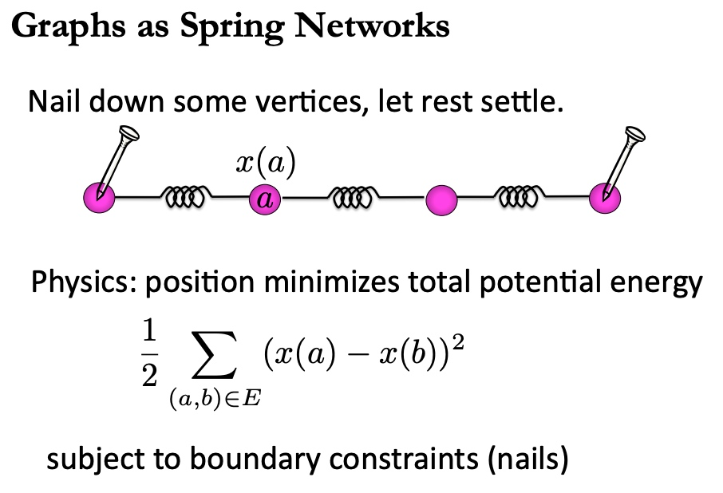
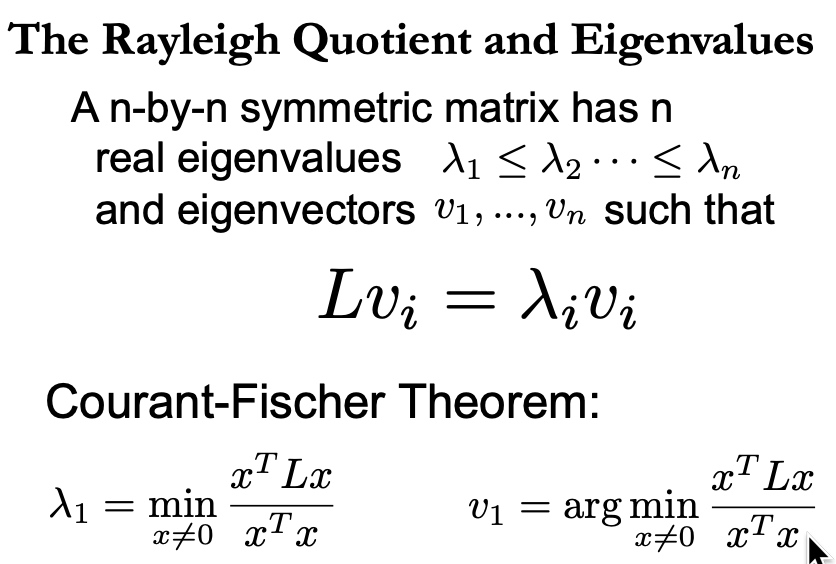
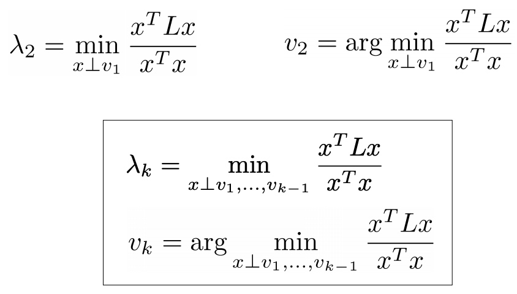
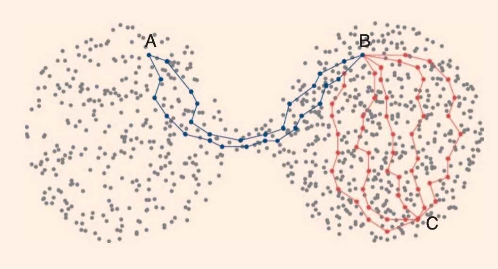
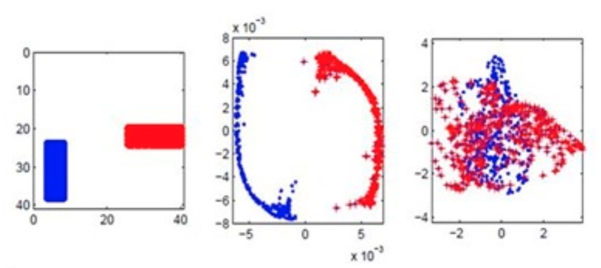
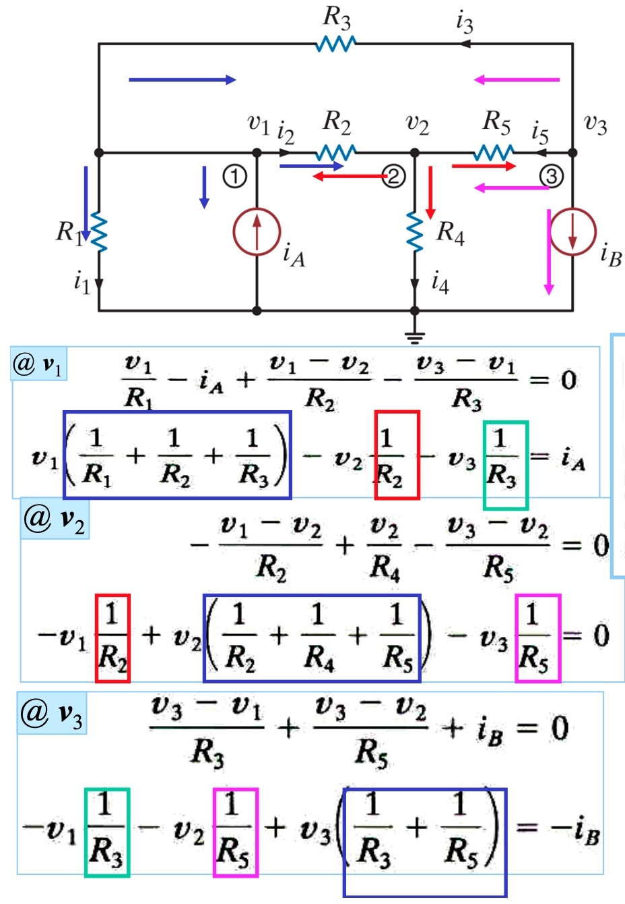
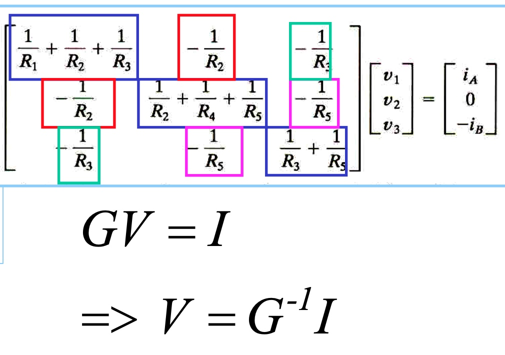

# NexT

> 精于心，简于形

NexT 是由 [Hexo NexT](https://github.com/iissnan/hexo-theme-next) 移植而来的 Jekyll 主题。<!--commit: f951075d9b739d26b42472431995fa68d08796aa-->

<a href="http://simpleyyt.github.io/jekyll-theme-next/" target="_blank">在线预览 Preview</a> | <a href="http://simpleyyt.com" target="_blank">Yitao's Blog</a> | <a href="http://theme-next.simpleyyt.com" target="_blank">NexT 使用文档</a> |  [English Documentation](README.en.md)

[](https://gitter.im/jekyll-theme-next/lobby?utm_source=badge&utm_medium=badge&utm_campaign=pr-badge&utm_content=badge)


## 浏览器支持 Browser support


## 贡献 Contributing

欢迎提交问题与需求，修复代码。


## 开发 Development

NexT 主旨在于简洁优雅且易于使用，所以首先要尽量确保 NexT 的简洁易用性。

NexT is built for easily use with elegant appearance. First things first, always keep things simple.


## 捐赠

支付宝捐赠链接还是要有的，万一真的有人捐呢。


# Discrete Laplacian Operator on Graph 
最先把拉普拉斯算子引入圖論 (graph theory) 非常有創意。兩者看起來沒什麼關係。拉普拉斯算子廣泛用於物理現象的計算，例如熱傳導，電磁場，量子力學等等。這樣的算子居然可以用於圖論的 graph partition, manifold learning, 實在是出乎意料。

不過有一個類比可以參考 (appendix)：電磁學 (based on Maxwell equation: Laplacian wave equation) 到電路學 (based on KCL and KVL: discrete graph).

## 拉普拉斯矩陣 [@wikiLaplacianMatrix2019]
最常見的物理公式和 discrete Laplacian 的類比。
**1. 熱傳導 (heat diffusion)** 
$$\Delta \varphi(\vec{r},t) = -\frac{1}{c}\frac{\partial}{\partial t}\varphi(\vec{r},t)\quad c\text{ is conductivity}$$

The Laplacian matrix can be interpreted as a matrix representation of a particular case of the discrete Laplace operator. Such an interpretation allows one, e.g., to generalise the Laplacian matrix to the case of graphs with an infinite number of vertices and edges, leading to a Laplacian matrix of an infinite size.

Suppose $\phi$ describes a heat distribution across a graph, where $\phi_i$ is the heat at vertex $i$. According to Newton's law of cooling, the heat transferred between nodes $i$ and $j$ is proportional to $\phi_i - \phi_j$. if nodes $i$ and $j$ are connected (if they are not connected, no heat is transferred). Then, for heat capacity $k$,
$$
\begin{aligned} \frac{d \phi_{i}}{d t} &=-k \sum_{j} A_{i j}\left(\phi_{i}-\phi_{j}\right) \\ &=-k\left(\phi_{i} \sum_{j} A_{i j}-\sum_{j} A_{i j} \phi_{j}\right) \\ &=-k\left(\phi_{i} \operatorname{deg}\left(v_{i}\right)-\sum_{j} A_{i j} \phi_{j}\right) \\ &=-k \sum_{j}\left(\delta_{i j} \operatorname{deg}\left(v_{i}\right)-A_{i j}\right) \phi_{j} \\ &=-k \sum_{j}\left(\ell_{i j}\right) \phi_{j} \end{aligned}
$$

另一個角度是用 KCL and KVL 類比。注意電路學仍然有 time varying part, quasi-static, 參考 appendix.  Voltage = $\phi$, conductance=k,  $I_{ij} = k(\phi_i-\phi_j)$

所以 Laplace matrix $L = D - A$, $D$ 是 diagonal degree matrix, $A$ 是 adjacent matrix. 


基本解就是 Helmholtz equation:
$$\Delta \varphi + \lambda \varphi = 0$$

## Laplacian Matrix 特性
Assuming graph G(V, E) with n vertex
* $\lambda_{n-1} \ge ...\ge\lambda_2\ge\lambda_1\ge\lambda_0=0$
* 因為 x=(1,1,...,1)' 對應 $Lx=\lambda_0 x$, and $\lambda_0=0$.
* $\lambda_1$ 對應最少 cut 的 graph partition. 所以 $\lambda_1=0$ 代表 graph 有不連通的 subgraph.
* 因為 minimize yLy', where y = (1, 1, .. -1, -1)?

## Laplacian matrix with kernel
前面假設 equal weights/conductance, $k$, for all edges. 在一些應用比較好的方式是不同的 weights (conductance), between 0 and 1.  

如果每個 vertex pair 都有距離，可以用 **heat kernel** $w_{ij} = \exp(-\frac{\|x_i-x_j\|^2}{c})$.  W 定義好，D 就是 diagonal matrix, $d_{ii} = \sum{w_{ij}}$. and $L=D-W$.  同樣 $\lambda_0 = 0$, 對應的 eigenvector = (1,1,..1)'.

如果要計算所有的 vertex pair, 太多 pairs. 實務上有兩個方法 truncate edge: (a) $\epsilon$-neighborhoods: $\|x_i-x_j\|^2 < \epsilon \to w_{ij} = 0$; (b) machine learning n nearest neighborhood method (K=5, 6, 7, etc.).


##Laplacian Matrix in Machine Learning 
**第一步是建立 adjacent graph，用 matrix 表示。**
如果要計算所有的 vertex pair, 太多 pairs. 實務上有兩個方法 truncate edge: (a) $\epsilon$-neighborhoods: $\|x_i-x_j\|^2 < \epsilon$.  優點：本於幾何；對稱 matrix. 缺點：需要選擇 $\epsilon$, 太大得到 disconnected graph, 太小則太多 edges. 
(b) machine learning n nearest neighborhood method (K=5, 6, 7, etc.).  缺點：less geometrically intuitive.

**第二步是選擇 weights, 建立 similarity matrix $W$, 同樣有兩個方式。**
(a) heat kernel. 如果 (i, j) is connected, $W_{ij} = e^{-\frac{\|x_i-x_j\|^2}{t}} $
(b) 只用 0 and 1.

**第三步 (eigenmaps): 定義 $D_{ii} = \sum_j W_{ji}$. $L = D-W$ 是拉普拉斯矩陣。**為什麼如此定義？從上述的例子以及 KCL 可以看出就是 $\nabla\cdot \mathbf{J}=0$.  $W_{ij}$ 就是 vertex *i 和 j* 的 conductance!! 
Laplace eigenmap (LE) 就是解下列方程式的 eigenvalues!

$$L\mathbf{f} = \lambda D\mathbf{f} \quad\equiv\quad (LD^{-1})(D\mathbf{f}) = \lambda(D\mathbf{f}) \quad\equiv\quad (D^{-1}L)\mathbf{f} = \lambda\mathbf{f} \\ 
\quad\equiv\quad (D^{-1/2}LD^{-1/2})(D^{1/2}\mathbf{f}) = \lambda(D^{1/2}\mathbf{f})$$

為什麼等式得右邊要加上 *D?* 其實是計算 $D^{-1/2}LD^{-1/2} = I - D^{-1/2}WD^{-1/2}$ 的 eigenvalues.  (Eigenvector scales by $D^{1/2}$.)
* Normalize $L$ matrix diagonal elements 為 1.
* $D^{-1/2}LD^{-1/2}$ 是對稱 matrix, 保證所有 eigenvalues $\ge$ 0.
* Minimize $\sum_{ij} (x_i - x_j)^2 W_{ij}$.  對應電路理論的最低功耗, $\sum_k V_k^2/R_k=\sum_k V_k^2 G_k$, 或是 spring network 的最低勢能如下。  


* 重點是設定 boundary condition, 以及排除 trivial solution.

## 拉普拉斯矩陣，So What?
* Optimal embedding: Let ***y*** be a same dimension embedding of ***x***. Why? 因為 $W_{ij} \sim \|x_i-x_j\|^2$, 只是距離的函數。如果所有 $x_i$ 平移結果仍然不變。所謂 optimal embedding 就是 minimize energy/power representation. 
$$ \text{minimize}\quad \frac{1}{2}\sum_{ij} (y_i - y_j)^2 W_{ij} = \mathbf{y}^T L \mathbf{y}$$  變成 $$\text{argmin}_\mathbf{y} \mathbf{y}^T L \mathbf{y} \qquad \text{subject to}\quad \mathbf{y}^T D \mathbf{y}=1 \quad\text{and}\quad \mathbf{y}^T D \mathbf{1}=0$$  為了避免 scaling factor, 加上 $\mathbf{y}^T D \mathbf{y}=1$ constraint (boundary condition); 另外為了避免選到 $\lambda_0=0$ 和對應的 eigenvector **1**, 加上另一個必須和 **1** 垂直的 eigenvector 的限制 $\mathbf{y}^T D \mathbf{1}=0$. 如果用 $D=I$ identity matrix 更容易理解。
* 結果就是次小的 eigenvalue $\lambda_1$ (exclude $\lambda_0=0$).
* 這是 Courant-Fischer theorem 的推廣：[@spielmanLaplacianMatrices2011]



* $\lambda_1 > 0$ if and only if G is connected.
* 以上是在最小 eigenvalue (exclude 0) 對應的 eigenvector 投影。這是 1-dimension case.  可以推廣 1-dimension to m-dimensions Euclidean embedding, 就是用更多的 eigenvectors. 參考 reference.
* 降到幾維就是選幾個 eigenvectors 做投影。
* PCA and MDS? 是選大的 eigenvalues, why the difference?

##Laplacian Eigenmaps (LE)
[@belkinLaplacianEigenmaps2003]
relationship to spectra clustering
eigenvalue and eigenvector of L
**第一步是建立 adjacent graph，用 matrix 表示。**
For each $x_i$, find the ***n*** nearest neighbors.

**第二步是選擇 weights in high dimension use heat kernel, 建立 similarity matrix, $W$**

**第三步是定義 $D_{ii} = \sum_j W_{ji}$. $L = D-W$ 是拉普拉斯矩陣。** 更重要的是 normalized 拉普拉斯矩陣 $D^{-1/2}LD^{-1/2} = I - D^{-1/2}WD^{-1/2}$ 的 eigenvalues.  (Eigenvector scales by $D^{1/2}$.)
Embedding 就是取 k lowest eigenvalues 對應的 eigenvectors of the matrix: $D^{-1/2}U$.

##Locally Linear Embedding (LLE)
LLE: eigenvalue and eigenvector of L^2 
LE and LLE are the same thing!
LLE 主要的目的是降維。Give a data set $x_1, x_2, ... x_k$ in a high-dimension $\mathbb{R}^l$.  The goal is to find a low-dimensional representation $y_1, y_2, ..., y_k \in \mathbb{R}^m, m \ll k$.

**第一步是建立 adjacent graph，用 matrix 表示。**
這一步和 LE 一樣。For each $x_i$, find the ***n*** nearest neighbors.

**第二步是選擇 weights in high dimension, 這和 LE 用 heat kernel 不同**
找出 $W_{ij}$ such that $\sum_j W_{ij}x_{i_j}$ equals the orthogonal projection of $x_i$ onto the affine linear space of $x_{i_j}$.  也就是 minimize:
$$\sum_{i=1}^{l}\left\|\mathbf{x}_{i}-\sum_{j=1}^{n} W_{i j} \mathbf{x}_{i_{j}}\right\|^{2}\qquad\text{subject to}\qquad \sum_j W_{ij} =1$$

**第三步是計算 embedding**
Embedding 就是取 k lowest eigenvalues 對應的 eigenvectors of the matrix: $E = (I-W)^T (I-W)$, where *E* is symmetric PSD matrix.
$$ Ef \approx \frac{1}{2} L^2 f $$
$L^2$ 的 eigenvector 和 $L$ 的 eigenvector 一樣。只是 eigenvalues 差平方倍。

 
##Diffusion Maps (DM) Algorithm
Keyword: Markov chain, path integral from quantum mechanics.
前面的ISOMAP、LLE、LE等方法的基本思路都是通过用数据点在欧式空间的局部分布来逼近原流形空间的局部分布，以此推测其全局结构，但是本节将要进行介绍的Diffusion Map则很不一样，它从概率或者说随机漫步(Random Walk)的角度出发，用各个点之间的连通性来描述远近，例如假设点A与点B之间有很多条高概率的路径，之前几种方法几乎都是选择概率最大（距离最近）的一条来定义距离，而Diffusion Map则会把所有这些路径的概率值全部加起来，整个求解过程就像某个对象在整个图模型中进行随机游走，计算最终平稳后落在每个点的概率。
**雖然 diffusion map 基本原理或詮釋來自隨機漫步。所有的計算都是 deterministics.**

具体实现起来:
第一步是建立 adjacent graph，$\epsilon$-neighborhoods: $\|x_i-x_j\|^2 < \epsilon$.  or (b) k nearest neighborhood graph.

第二步是選擇 weights, 建立 similarity matrix $W$.

**第三步定義 $P = D^{-1}W$** transition probability matrix.
**P矩阵可以认为包含了目标对象从任意一点i经过一步转移到j的概率值，接下来如果我们继续计算P的k次幂，则可以得到从任意一点i经过k步跳转到j的概率值，可以想象，通过不断计算 $P^t$ 我们可以知道整个数据在不同时刻的概率分布变化过程，一般把这个过程称为Diffusion Process。**

### Diffusion distance and maps
有了上面的Diffusion Process，我们可以***定义一个更一般性的diffusion 距离矩阵***
$$D_{t}\left(X_{i}, X_{j}\right)^{2}=\sum_{u \in X}\left\|p_{t}\left(X_{i}, u\right)-p_{t}\left(u, X_{j}\right)\right\|^{2}=\sum_{k}\left\|P_{i k}^{t}-P_{k j}^{t}\right\|^{2}$$

之后就用类似MDS的方法，在新空间中计算一个最能保持这个距离的坐标即可。

另外可以用 transition matrix (with parameter t) 的 eigenvalues $\lambda_i$ and eigenvectors $\psi_i$ ***定義 diffusion map:***
$$\Psi_{t}(\boldsymbol{x})=\left(\lambda_{1}^{t} \psi_{1}(\boldsymbol{x}), \lambda_{2}^{t} \psi_{2}(\boldsymbol{x}), \cdots, \lambda_{k}^{t} \boldsymbol{\psi}_{k}(\boldsymbol{x})\right)$$

Diffusion distance 和 diffusion map 的關係如下：
$$D_{t}\left(\boldsymbol{x}_{0}, \boldsymbol{x}_{1}\right)^2=\sum_{j \geq 1} \lambda_{j}^{2 t}\left(\psi_{j}\left(x_{0}\right)-\psi_{j}\left(x_{1}\right)\right)^{2}=\left\|\Psi_{t}\left(\boldsymbol{x}_{0}\right)-\Psi_{t}\left(\boldsymbol{x}_{1}\right)\right\|^{2}$$

* Diffusion distance and map 都和 $t$ 相關。*t* 是一個可以調整的參數。
* Diffusion distance 可以視為 "soft weighted distance", 類似量子力學的所有路徑積分。最大的好處是 robust to noise perturbation。這正好是 manifold learning algorithm 最大的弱點。下圖 $D(B,C)<D(A,B)$.
* 两个随机游走的機率相减是在比较i、j跳转到其它点u的概率分布差异性，例如i、j都有0.3的概率跳转到A，0.1的概率跳转到B，0.6的概率跳转到C，那么i和j的距离就应该是0（相似度高），相反，如果i到A、B、C的概率分别为0.3、0.1、0.6，而j到A、B、C的距离分别为0.3、0.6、0.1，那么i和j的距离应该很远（相似度低），从某种角度上看，Diffusion Map可以算是一种soft版本的LE，同样是局部点的分布影响较大，远的点影响较小，不同在于LE的相似度矩阵 W 是用 ϵ-neighbours graph或者k-nearest neighbours graph 产生的边，而Diffusion Map则通过t来调节扩散的scale。
* Diffusion distance = Euclidean distance in diffusion map space (with all n-1 eigenvectors)!
* "Diffusion maps" - "eigenvalues" = "Laplacian eigenmaps".  但是 diffusion maps with parameter *t*.


The Euclidean distance and the geodesic distance
(shortest path) between points A and B are roughly the same as those between points B and C. However, the diffusion distance between A and B is much larger since it has to go through the
bottleneck. Thus, the diffusion distance between two individual points incorporates information of the entire set, implying that A and B reside in different clusters, whereas B and C are in the
same cluster. This example is closely related to spectral clustering.
 
**The basic algorithm framework of diffusion map is as:**

Step 1. Given the similarity matrix L

Step 2. Normalize the matrix according to parameter $\alpha$ : $${\displaystyle L^{(\alpha )}=D^{-\alpha }LD^{-\alpha }}L^{{(\alpha )}}=D^{{-\alpha }}LD^{{-\alpha }}$$

Step 3. Form the normalized matrix $${\displaystyle M=({D}^{(\alpha )})^{-1}L^{(\alpha )}}M=({D}^{{(\alpha )}})^{{-1}}L^{{(\alpha )}}$$

Step 4. Compute the k largest eigenvalues of $M^{t}$ and the corresponding eigenvectors

Step 5. Use diffusion map to get the embedding $\Psi _{t}$.  另一種方式是計算 diffusion distance $D_t$, 再用類似 MDS 計算 embedding.  

## 比較 PCA, MDS, ISOMAP, LE, LLE, MD (unsupervised learning 降維)
上文已經說到 LE, LLE 基本是同一類算法，基於 graph laplacian 的 **最小eigenvalues (0 除外)** and eigenvectors.  LE and LLE 的想法是降維儘量保持 **local relationship characteristics**, 但不是 isometry. 白話文就是降維時局部鄰居儘量住在附近，但整體的佈局會很不一樣。Diffusion maps 可視為 "soft weighted" Laplacian eigenmaps, 使用 $t$ 參數控制 diffusion maps and distance, 包含所有可能路徑。robust to noise perturbation. **$t$ 可以平衡 local and global information.**  另外 weighted by eigenvalues. **結論：LE and LLE (not DM) 重視 local more than global.**

PCA 是降維算法的祖師爺和 baseline.  PCA 的想法就完全不同！降維儘量保持**global information/entropy/variance**, 也就是保持最大熵。實際作法先計算 covariance matrix, 再取**最大 eigenvalues** and eigenvectors.  MDS 基本和 PCA 是等價，只是用 distance matrix 替代 covariance matrix (similarity matrix).  IOSMAP 是 manifold 的 MDS, 用 geodesic 代替 euclidean distance.  **結論：PCA, MDS, ISOMAP 重視 global information/entropy/variance.** 

另一種分類：PCA and MDS 適用於歐氏空間。ISOMAP/LE/LLE/DM 都是用 neighborhood graph 適用於 manifold space. 

下圖是一個 toy example. [@belkinLaplacianEigenmaps2003] 原始資料如下圖左：1000 images of size 40x40, image 是紅色水平長方形或是藍色垂直長方形 at random location (顏色只是視覺效果，並非 labels). 也就是在 1600 dimension 有 1000 random data points (對應 500 水平長方形和 500 垂直長方形）。
下圖中是 Laplacian Eigenmaps 降維從 1600-dimension to 2-dimension.  下圖右是傳統 PCA 降維從 1600-dimension to 2-dimension.  明顯在這類 data set (different local structure of **clustering**) LE 可以分類，但是 PCA 無法分類。



##Appendix

###電路學的基石：KCL and KVL
電路學的基礎 KCL and KVL (Kirchhoff current/voltage laws) 是 Maxwell equations 在近穩態 (quasi-static) 的簡化解。

首先是 Maxwell equation 和 continuity equation. [@larssonElectromagneticsQuasistatic2007]
$$\begin{array}{c}{\nabla \cdot \mathbf{E}=\frac{\rho}{\varepsilon_{0}}} \\ {\nabla \cdot \mathbf{B}=0} \\ {\nabla \times \mathbf{E}=-\frac{\partial \mathbf{B}}{\partial t}} \\ {\nabla \times \mathbf{B}=\mu_{0}\left(\mathbf{J}+\varepsilon_{0} \frac{\partial \mathbf{E}}{\partial t}\right)} \\ {\frac{\partial\rho}{\partial t} + \nabla\cdot\mathbf{J}=0} \end{array}$$

對應的拉普拉斯算子有兩種：Lorentz gauge 和 Coulomb gauge. [@wikiGaugeFixing2019]
**Lorentz gauge**, $\nabla\cdot\mathbf{A} + \frac{1}{c}\frac{\partial V}{\partial t}=0$
$$\begin{aligned} \Delta V-\frac{1}{c^{2}} \frac{\partial^{2}}{\partial t^{2}} V &=-\frac{\rho}{\epsilon_{0}} \\ \Delta \mathbf{A}-\frac{1}{c^{2}} \frac{\partial^{2}}{\partial t^{2}} \mathbf{A} &=-{\mu_{0}}{\mathbf{J}} \end{aligned}$$

####更簡潔用張量表示 [@wikiMaxwellEquations2019]
定義 EM four-potential (1,0) 張量 $A^{\mu} = \left[ \frac{V}{c}, \mathbf{A}\right]$.  
以及 four-current (1,0) 張量 $J^{\mu} = \left[ c\rho, \mathbf{J}\right]$.
EM field 變成 (2,0) EM-張量：$F^{\mu\nu} = \partial^{\mu} A^{\nu} - \partial^{\nu} A^{\mu}$. tensor form: $\mathbf{\hat{\hat{F}}} = \nabla\times\mathbf{\hat{A}}$?


Lorentz gauge in Minkowski space：$\partial_{\mu} A^{\mu} = 0$; in curved space: $\nabla_{\mu} A^{\mu} = 0$; tensor form: $\nabla\cdot\mathbf{\hat{A}}=0$

Wave equation (Laplacian operation in 4-D): $\square A^{\alpha} = \partial_{\beta}\partial^{\beta}A^{\alpha}=\mu_o J^{\alpha}$; in curved space: $\nabla_{\beta}\nabla^{\beta}A^{\alpha} - R_{\beta}^{\alpha}A^{\beta}=\mu_o J^{\alpha}$.   tensor form: $\Delta\mathbf{\hat{A}} - ... = \mu_o \mathbf{\hat{J}}$?

Maxwell field equation using $\mathbf{\hat{\hat{F}}}$, 和 gauge 無關:$\nabla_{\alpha}F^{\alpha\beta} = \mu_o J^{\beta}$ and $
F_{\alpha \beta} =2 \nabla_{[\alpha} A_{\beta]}$

tensor form: $\nabla\cdot\mathbf{\hat{\hat{F}}}=\mu_o \mathbf{\hat{J}}$, and $\nabla\times\mathbf{\hat{\hat{F}}}=0$?

####最簡潔用群表示：TBA

**Coulomb gauge**, $\nabla\cdot\mathbf{A}=0$ (參考座標系使所有電荷運動為 0??? 無法用 covariant tensor!):
$$\begin{aligned}{\Delta V=-\frac{\rho}{\varepsilon_{0}}} \qquad\qquad\qquad \\ {\Delta \mathbf{A}-\frac{1}{c^{2}} \frac{\partial^{2}}{\partial t^{2}} \mathbf{A}=-\mu_{0} \mathbf{J}+\frac{1}{c^2} \nabla \frac{\partial V}{\partial t}}\end{aligned}$$


近穩態就是電路的工作頻率對應的波長大於幾何尺寸，$\frac{c}{f} > L$.  可以忽略時間的微分。只列出電場相關的公式。
$$\begin{array}{c}{\nabla \cdot \mathbf{E}=\frac{\rho}{\varepsilon_{0}}} \\ {\nabla \times \mathbf{E}= 0} \\ {\nabla\cdot\mathbf{J}=0} \end{array}$$


從 $\nabla \times \mathbf{E}= 0$, 可以得出 $\oint \mathbf{E}\cdot d\mathbf{L} = 0$ 以及 $\mathbf{E}= -\nabla V$ and $V_{ab} = -\int _a^b\mathbf{E}\cdot d\mathbf{L}$.  就是 KVL.
從 $\nabla\cdot\mathbf{J}=0$， 可以得出 $\iint \mathbf{J}\cdot d\mathbf{S} = I_{enc} = 0$.  就是 KCL.
把  $\mathbf{E}= -\nabla V$ 代入 $\nabla \cdot \mathbf{E}\,$, 得到勢能在近穩態的拉普拉斯算子 $\Delta V = -\frac{\rho}{\varepsilon_{0}}$. 一般用在空間正負電荷分離分佈的勢能場計算，例如 dipole, 電容，傳輸線。
**電路學假設電中性，整體的基礎是 base on KVL and KCL.**

####KCL: Nodal analysis + conductance matrix [@wikiNodalAnalysis2018]
一個電路有 N nodes, for node *k*, KCL: $$\sum_{j\ne k} G_{jk}(v_k - v_j) = 0 \to G_{kk}v_k - \sum_{j\ne k} G_{jk}v_j = 0$$
$G_{kk}$ 是接到 node *k* conductance 的總和。如果有額外的 current source $i_k$ 連接到 node *k*, $i_k = G_{kk}v_k - \sum_{j\ne k} G_{jk}v_j$.  用矩陣表示：$\mathbf{GV = I}$
$$\left(\begin{array}{cccc}{G_{11}} & {G_{12}} & {\cdots} & {G_{1 N}} \\ {G_{21}} & {G_{22}} & {\cdots} & {G_{2 N}} \\ {\vdots} & {\vdots} & {\ddots} & {\vdots} \\ {G_{N 1}} & {G_{N 2}} & {\cdots} & {G_{N N}}\end{array}\right)\left(\begin{array}{c}{v_{1}} \\ {v_{2}} \\ {\vdots} \\ {v_{N}}\end{array}\right)=\left(\begin{array}{c}{i_{1}} \\ {i_{2}} \\ {\vdots} \\ {i_{N}}\end{array}\right)$$.

因為 KCL 要求所有所有 current source *i_k* 總和為 0， $\sum_k i_k = 0$. 所以 $G$ 是 singular matrix, i.e. eigenvalue $\lambda_0 = 0$.  一般會把 $v_N = 0$, 把 $N\times N$ sigular matrix 變成 $(N-1)\times (N-1)$ non-sigular matrix.  

用一個具體的[例子](http://webftp.cjcu.edu.tw/~inhon/ppt/ec_98/chap_3.pdf)如下。
此處已經把 $v_4=0$ 代入，所以得到 3x3 non-singular matrix.  如果要類比 4x4 singular matrix, 就要把 $v_4$ 加入，會得到 4x4 sigular matrix, 每一個 row 的總和為 0!  正如同 Laplacian graph 一樣！
$$ G_{4x4} :
\left[\begin{array}{ccc}{G_1+G_2+G_3} & {-G_2} & {-G_3} & {-G_1}\\ {-G_2} & {G_2+G_4+G_5} & {-G_5} & {-G_4}\\ {-G_3} & {-G_5} & {G_3+G_5} & {0} \\ {-G_1} & {-G_4} & {0} & {G_1+G_4} \end{array}\right]\left[\begin{array}{c}{v_{1}} \\ {v_{2}} \\ {v_{3}} \\ {v_{4}}\end{array}\right]=\left[\begin{array}{c}{i_{A}} \\ {0} \\ {-i_{B}} \\ {-i_A + i_B}\end{array}\right]
$$




如果把獨立電流源 $i_k$ 改成電容 (with initial condition).  $i_k = c_k \frac{d v_k}{dt}$, 等式右邊就變成 V 對時間一次微分：*heat equation*.  如果再加上 inductor, 等式右邊就多了時間一次積分：*damped oscillation equation*.

####KVL: Loop analysis + impedance matrix

####Julia LE and LLE examples
先說結論。
LE 是計算 $D^{-1/2}LD^{-1/2} = U \Lambda U^T$ 的 eigenvalues. Embedding: $D^{-\frac{1}{2}} U$.
LLE 是計算 $1/2 L^2 = \hat{U} \hat{\Lambda} \hat{U}^T$ 的 eigenvalues. Embedding: $\hat{U}$. 
Embedding $D^{-\frac{1}{2}} U$ or $\hat{U}$ 的 **columns** 是 eigenvectors.
注意 embedding 一定有一個 $\mathbf{1}$ eigenvector, 對應 eigenvalue=0.  降維就是高維的 vector 在 eigenvectors 的投影！除了 $\mathbf{1}$ 以外。如果是降到 1 維，就選次小的 eigenvalue 的 eigenvector.

```
using LinearAlgebra
W = [0. 0.3 0.7; 0.3 0. 1.7; 0.7 1.7 0.]
D = [1. 0. 0.; 0. 2. 0.; 0. 0. 2.4]
L = D - W
# D^(1/2) and D^(-1/2)
D1_2 = sqrt.(D)
D_1_2 = inv(D1_2)

## Laplace Eigenmap
D_1_2LD_1_2 = D_1_2*L*D_1_2
l_le = eigvals(D_1_2LD_1_2)
U_le = eigvecs(D_1_2LD_1_2)
embed_le = D_1_2 * U_le

## Locally Linear Embedding
LL = 0.5*L*L
l_lle = eigvals(LL)
U_lle = eigvecs(LL)
embed_lle = U_lle

## LE solution here
julia> W
3×3 Array{Float64,2}:
 0.0  0.3  0.7
 0.3  0.0  1.7
 0.7  1.7  0.0

julia> D 
3×3 Array{Float64,2}:
 1.0  0.0  0.0
 0.0  2.0  0.0
 0.0  0.0  2.4

julia> L
3×3 Array{Float64,2}:
  1.0  -0.3  -0.7
 -0.3   2.0  -1.7
 -0.7  -1.7   2.4

julia> D1_2
3×3 Array{Float64,2}:
 1.0  0.0      0.0    
 0.0  1.41421  0.0    
 0.0  0.0      1.54919

julia> D_1_2
3×3 Array{Float64,2}:
 1.0  0.0       0.0     
 0.0  0.707107  0.0     
 0.0  0.0       0.645497

julia> D_1_2LD_1_2 = D_1_2*L*D_1_2
3×3 Array{Float64,2}:
  1.0       -0.212132  -0.451848
 -0.212132   1.0       -0.77594 
 -0.451848  -0.77594    1.0     

julia> l_le = eigvals(D_1_2LD_1_2)
3-element Array{Float64,1}:
 0.0               
 1.1818019484660534
 1.818198051533946 

julia> U_le = eigvecs(D_1_2LD_1_2)
3×3 Array{Float64,2}:
 -0.430331   0.869825  -0.241286
 -0.608581  -0.476988  -0.634123
 -0.666667  -0.126041   0.734622

julia> embed_le = D_1_2 * U_le
3×3 Array{Float64,2}:
 -0.430331   0.869825   -0.241286
 -0.430331  -0.337282   -0.448393
 -0.430331  -0.0813592   0.474196

julia> LL = 0.5*L*L
3×3 Array{Float64,2}:
  0.79    0.145  -0.935
  0.145   3.49   -3.635
 -0.935  -3.635   4.57 

julia> l_lle = eigvals(LL)
3-element Array{Float64,1}:
 0.0
 1.0527010808648647    
 7.797298919135132     

julia> U_lle = eigvecs(LL)
3×3 Array{Float64,2}:
 0.57735   0.808449  -0.114355
 0.57735  -0.503259  -0.64296 
 0.57735  -0.30519    0.757315

julia> embed_lle = U_lle
3×3 Array{Float64,2}:
 0.57735   0.808449  -0.114355
 0.57735  -0.503259  -0.64296 
 0.57735  -0.30519    0.757315
```

##Reference
Belkin, Mikhail, and Partha Niyogi. 2003. “Laplacian Eigenmaps for
Dimensionality Reduction and Data Representation.” *Neural Computation*
15 (6): 1373–96. <https://doi.org/10.1162/089976603321780317>.

Larsson, Jonas. 2007. “Electromagnetics from a Quasistatic Perspective.”
*American Journal of Physics* 75 (3): 230–39.
<https://doi.org/10.1119/1.2397095>.

Spielman, Daniel A. 2011. “Laplacian Matrices of Graphs:” 84.

Wiki. 2018. “Nodal Analysis.” *Wikipedia*.
<https://en.wikipedia.org/w/index.php?title=Nodal_analysis&oldid=868625791>.

———. 2019a. “Laplacian Matrix.” *Wikipedia*.
<https://en.wikipedia.org/w/index.php?title=Laplacian_matrix&oldid=914604514>.

———. 2019b. “Gauge Fixing.” *Wikipedia*.
<https://en.wikipedia.org/w/index.php?title=Gauge_fixing&oldid=916521094>.

———. 2019c. “Maxwell’s Equations.” *Wikipedia*.
<https://en.wikipedia.org/w/index.php?title=Maxwell%27s_equations&oldid=920355325>.
