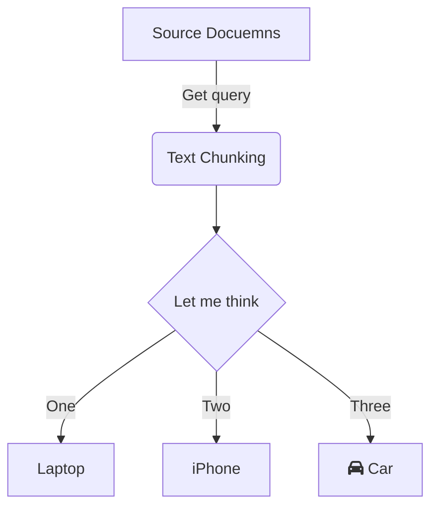

## Introduction

RAG (Retrival Augmented Generation) advantage lies in its ability to effectively combine retrieval and generation processes, enabling it to leverage vast amounts of external knowledge while maintaining coherent and contextually relevant outputs.

Most retrieval processes use a **vector database** to efficiently store and query **high-dimensional data representations**, such as embeddings derived from machine learning models.

There is another data representation using graph that can effectively illustrate relationships and trends within datasets.   There are several advantages of using graph representation vs. vector representation.

![[Pasted image 20240810234106.png]]

## Vector Vs. Graph Representation

Here’s a comparison table summarizing the pros and cons of graph representation versus vector representation:

| **Aspect**           | **Graph Representation**                                               | **Vector Representation**                      |
| -------------------- | ---------------------------------------------------------------------- | ---------------------------------------------- |
| **Scope**            | **Holistic view** (global and local)                                   | Local similarity                               |
| **Visual Clarity**   | Clear visual representation of relationships                           | Simple but less visual clarity                 |
| **Relationship**     | Effectively illustrates relationships between entities                 | Limited ability to show relationships          |
| **Complexity**       | Can become cluttered with large datasets and computationally intensive | Generally simpler and easier to interpret      |
| **Interpretability** | Intuitive visual representation of trends and relationships            | May lack intuitive insights into relationships |
| Cost                 | Expensive to index                                                     | Cheap to index                                 |


## How to Generate Graph Representation?

The first step is how to generate the graph representation, including the embedding, database, and the graph structure?   Not surprisingly, we can use LLM to go it. 


### Vector RAG

**Concept:** Vector-Based RAG uses vector representations to store and retrieve information. These vectors are high-dimensional embeddings that capture semantic meanings of words, sentences, or documents. The process involves encoding the query into a vector and retrieving the closest matching vectors from a pre-indexed database.

**Mechanism:**

1. **Encoding (Indexing Phase):** The input query is encoded into a high-dimensional vector using models like BERT, GPT, or other transformer-based architectures.
2. **Retrieval (Query Phase):** This vector is then used to search a vector database (like FAISS or Annoy) for the nearest neighbors, which represent the most semantically similar pieces of information.
3. **Generation (Query Phase):** The retrieved information is then fed into a generative model to produce a coherent and contextually relevant response.

##### Caveate: the indexing and query phases may use different encoding/embedding methods!

Index Phase: generate vetor database

![[Pasted image 20240811202735.png]]

Query Phase
![[Pasted image 20240811202806.png]]


Disadvantage of RAG
- Limited contextual understanding - lack of holistic view
- Scalability - for big corpes 
- Complexity 





### Graph RAG

Indexing Phase
- The first two phases is the same as RAG
- The entity : (people, place) node,  the relationship: edge

![[Pasted image 20240811203003.png]]

Query Phase
![[Pasted image 20240811203300.png]]


#### Microsoft GRAPH RAG

It's about $0.11 to 

#### Text Embeddign
- use openai text-embedding-3-small
#### parse the graph using gpt-4o-mini.
- Extracted entities
- Extracted relationship
- create community summary

![[Pasted image 20240811212458.png]]


#### Global Vs. Local

**Caveate: Note, no special character (space or Chinese character in the path!!)**
I move the ./ragtest and ./lancedb folders from /mnt/g/My Drive/... to /mnt/c/Users/allen/ to solve the problem!

Query requres global content:  -->  Usual RAG would fail!
> python -m graphrag.query --root ./ragtest --method global "What are the top themes in this story?"

Query requres local content:
> python -m graphrag.query --root ./ragtest --method local "Who is Scrooge, and what are his main relationships?"


## Reference

Good youtube video:  https://www.youtube.com/watch?v=vX3A96_F3FU

Llamaindex knowledge Graph RAG (not very useful) : https://docs.llamaindex.ai/en/stable/examples/query_engine/knowledge_graph_rag_query_engine/#graphstore-backed-rag-vs-vectorstore-rag

Medium:  https://medium.com/@vkmauryavk/understanding-retrieval-augmented-generation-rag-vector-based-vs-graph-based-3fe6b90cc92a


## 引言

RAG 整合到 LLM 可以改善困惑度、事實準確性、下游任務準確性，和 in-context learning。結合獨立的檢索器，獨立的 RAG + LLM已被廣泛應用於處理具有長文檔問答。在先前的研究中，語言模型已在推論、微調, 和預訓練時進行了檢索增強。也有一些方法嘗試將 LLM 和 RAG 集成到單一模型中並建立端到端的解決方案。本文主要討論最常用的獨立 RAG + LLM 形式。

## 概要

圖形和檢索增強生成（RAG）。圖形和檢索增強生成（RAG）是自然語言處理（NLP）中兩個重要的技術，但它們可以結合在一起。當結合時，圖形和RAG可以通過同時整合結構化數據和非結構化文本來增強NLP系統的功能。這種整合可以實現更全面和準確的信息檢索，以及生成更相關和連貫的回答。通過利用圖形的力量，它以結構化格式表示實體之間的關係，並利用RAG從非結構化文本來源中檢索相關信息，NLP系統可以為用戶提供更豐富和個性化的上下文體驗。


Graph和RAG（檢索增強生成）。Graph和RAG（檢索增強生成）是自然語言處理（NLP）中兩個重要的技術，但它們可以結合在一起。當結合時，Graph和RAG可以通過將結構化數據和非結構化文本相結合來增強NLP系統的能力。這種整合允許更全面和準確的信息檢索，以及生成更相關和連貫的回答。通過利用Graph的力量，該格式表示了結構化格式中實體之間的關係，以及RAG從非結構化文本源中提取相關信息，NLP系統可以為用戶提供更豐富上下文並個性化的體驗。


圖形和RAG（檢索增強生成）是自然語言處理（NLP）中兩種重要的技術。但它們可以結合在一起。當結合時，圖形和RAG可以通過將結構化數據和非結構化文本相結合來增強NLP系統的功能。


|      | 僅LLM（雲端或邊緣）                       | 雲端+邊緣LLM<br>後仲裁                    | 雲端+邊緣LLM<br/>前仲裁        | 雲端資訊+<br>邊緣LLM RAG | 雲端資訊+<br>邊緣AutoGPT |
| ---- | --------------------------------- | ---------------------------------- | ----------------------- | ------------------ | ------------------ |
| 準確度  | 1. 基於預訓練知識，可能已過時。<br>2. 幻覺缺乏可信源泉。 | 1. 基於預訓練知識，可能已過時。<br/>2. 幻覺缺乏可信源泉。 | 最差。邊緣LLM錯誤<br>+ 雲端LLM錯誤 | 高                  | 中高                 |
| 成本   | 邊緣: 低;  雲端:高                      | 高                                  | 中等                      | 低                  | 中                  |
| 延遲   | 邊緣: 快;  雲端: 慢                     | 快                                  | 快                       | 慢？                 | 慢                  |
| 自我改進 | 不知道自己不知道。<br>上限：雲端LLM             | 是的，使用雲端LLM<br>微調邊緣LLM              | 可能                      | 是                  | 可能                 |


### RAG

**Vanilla RAG case** in brief looks the following way: you split your texts into chunks, then you embed these chunks into vectors with some Transformer Encoder model, you put all those vectors into an index and finally you create a prompt for an LLM that tells the model to answers user’s query given the context we found on the search step.
In the runtime we vectorise user’s query with the same Encoder model and then execute search of this query vector against the index, find the top-k results, retrieve the corresponding text chunks from our database and feed them into the LLM prompt as context.


The prompt can look like:

```python
def question_answering(context, query):
    prompt = f"""
                Give the answer to the user query delimited by triple backticks ```{query}```\
                using the information given in context delimited by triple backticks ```{context}```.\
                If there is no relevant information in the provided context, try to answer yourself, 
                but tell user that you did not have any relevant context to base your answer on.
                Be concise and output the answer of size less than 80 tokens.
                """

    response = get_completion(instruction, prompt, model="gpt-3.5-turbo")
    answer = response.choices[0].message["content"]
    return answer
```


Advanced RAG


## Source

* What is Retrieval Augmented Generation (RAG)  https://www.youtube.com/watch?v=T-D1OfcDW1M
* [Advanced RAG Techniques: an Illustrated Overview | by IVAN ILIN | Dec, 2023 | Towards AI](https://pub.towardsai.net/advanced-rag-techniques-an-illustrated-overview-04d193d8fec6)

