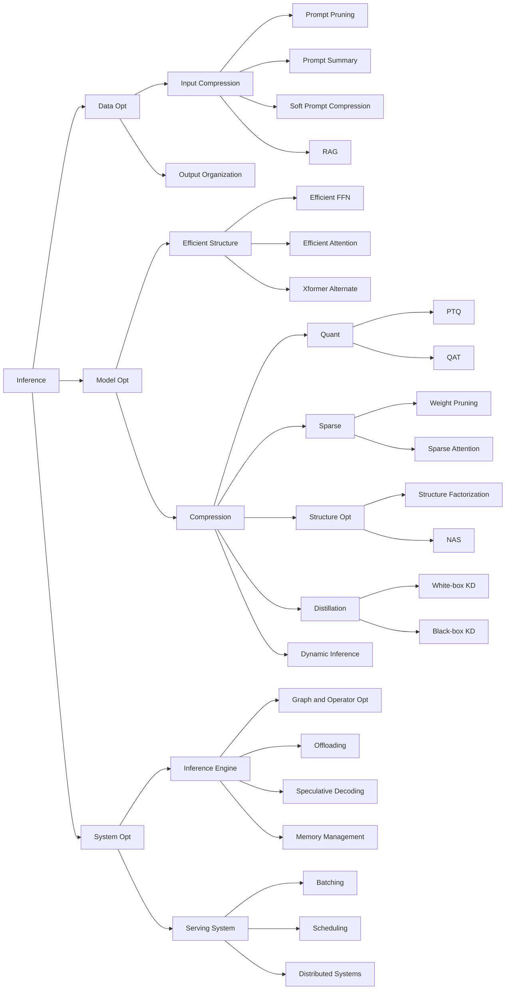

## Source

https://arxiv.org/pdf/2404.14294 A Survey on Efficient Inference for Large Language Models

https://arxiv.org/pdf/2006.16236 Efficient Transformers: A Survey 2022

## Training and Inference 兩階段

1.  Memory:  attention matrix A = softmax (Q K') :   LxL  :  **内存和 context length 是平方關係**。内存 size (= weight 40%,  attention matrix 30%) 決定一個 GPU 的上限。
2. Computation:  x (lxd) [Wq, Wk, Wv] (dx3d) and Q K' (lxl)  and softmax (LxL) : 在乘以 batch.  所以是 computation bound >> memory BW bound!!  **計算量也是和 context length 平方關係。**

## Inference 再分成兩階段：Prefill (prompt) and Decode (generation) 

Prefill = Training 
因爲 prefill mode 是 one-shot.   Prefill mode 的重點是 TTFT (Time-To-First-Token).  Dominate factor 主要是算力。但如果是 long input prompt, 內存也是重點。**但是因為是 causal mask, 可以一段一段填滿 kv cache 和 Attention matrix！**

整**體的 inference 時間主要是以 decode (generation) mode 爲主**。因為是 auto-regression token-by-token, **最大的瓶頸是在 kv cache + weight 的 memory BW.**

Generation mode:
1.  Memory:  attention matrix A = softmax (Q K') :  1xL.  KV Cache 代表**内存和 context length 是線性關係**。
2. Computation:  x (1xd) [Wq, Wk, Wv] (dx3d) and Q K' (1xL)  and softmax (1xL) : 在乘以 batch.  所以是 computation bound << memory BW bound!!  **計算量也是和 context length 線性關係。**

### Attention 部分比較表

| Stage                                     | Memory Requirement                              | Memory Bandwidth                    | Computation Requirement                   | Primary Bottleneck                                              | RNN                                |
| ----------------------------------------- | ----------------------------------------------- | ----------------------------------- | ----------------------------------------- | --------------------------------------------------------------- | ---------------------------------- |
| **Training**                              | Attn matrix with $L^2$                          | Weight only, shared by token length | Attn matrix grows with $L^2$              | **Computation-bound** (heavy matrix multiplications), 但可平行處理加速！ | Grows with $L$， Recursive, 無法平行加速！ |
| **Inference Prefill (one-shot training)** | same as above, 但可分段 to build causal attn matrix | same as above                       | Attn matrix grows with $L^2$, impact TTFT | **Computation-bound**, but **Memory-bound** for long prompts    | Grows with $L$                     |
| **Inference Generation (AR)**             | KV cache grows with $L$                         | Weight + KV cache for every token!  | Attn matrix grows with $L$                | **Memory bandwidth-bound** due to KV cache and weights          | Constant                           |

