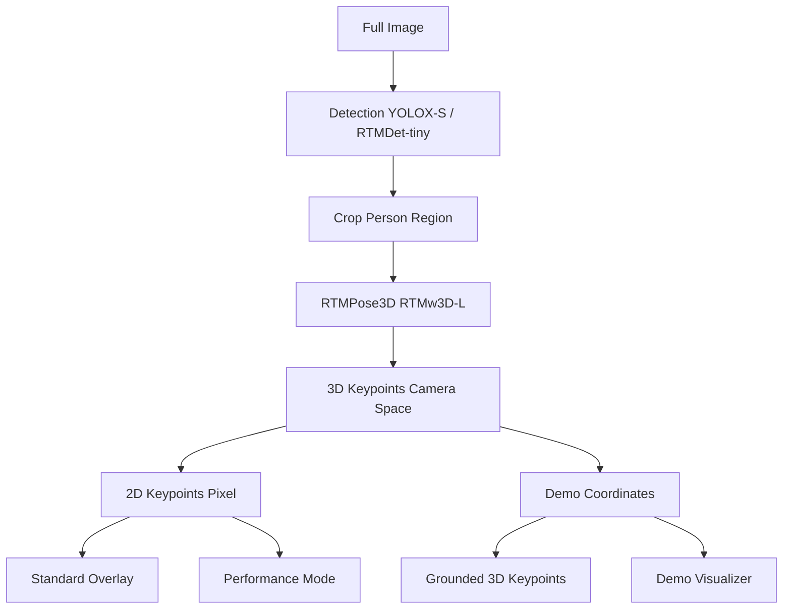

## Introduction

I am into bouldering and would like to do a project using AI for coaching.

## Pre-Stage

### Training Video Collection

**Scape youtube video of bouldering**
Search by names:
Janja, Ai Mori

**Download youtube video**:  https://www.youtube.com/shorts/m4b0uDBh4nE
use iMyFone TopClipper (no good)

Video Editing to remove head and tail.
CapCut or Microsoft Clipchamp

### Pose Detection

利用 mediapipe 做 pose detection.

轉 3D

### 應用

1. Video segmentation
2. Video pose language: Label flagging, cross-over, rock-over, ...

## Stage 1: MediaPipe - 2D Keypoints

## Stage 2:  MMPose - 2D Keypoints

Stage 4: VGGT - MoVieS

## Stage 3: MMPose - 3D Keypoints

First MMDetection, 首先做 object detection (YOLOX-S).  再直接做 3D keypoints / pose detection (rtmpose model).  從 3D keypoints in **camera space** 再轉成 2D keypoints 也做 2D **pixel coordinate** overlay!

# 🗂️ Model and Coordinate System Summary

## Model and Coordinate System Table

|Model Type|Model Name|Purpose|Input|Output Coordinates|Coordinate Space|Usage|
|---|---|---|---|---|---|---|
|🔍 Detection|YOLOX-S|Person localization|Full image|Bounding boxes [x1, y1, x2, y2]|Pixel coordinates|Crop person regions for pose estimation|
||RTMDet-tiny (fallback)|Person detection|Full image|Bounding boxes [x1, y1, x2, y2]|Pixel coordinates|Fallback person detection|
|🎯 3D Pose|RTMPose3D (RTMw3D-L)|End-to-end 3D pose|Person bbox crop|keypoints_3d [K, 3]|Camera space coordinates|3D analysis, visualization|
|📐 2D Pose|Derived from RTMPose3D|2D projection|Same as 3D|keypoints_2d [K, 2]|Pixel coordinates|2D overlay, visualization|

---

## 🗺️ Coordinate Systems and Transformations

|Coordinate System|Description|Format|Range|Source|Usage|
|---|---|---|---|---|---|
|Pixel Coordinates|Image pixel space|[u, v]|[0, width] × [0, height]|Detection model, 2D projection|2D overlay, bounding boxes|
|Camera Space|3D world coordinates|[X, Y, Z]|Real-world units (mm)|RTMPose3D direct output|3D analysis, depth estimation|
|Demo Transform|3D visualization space|[-X, Z, -Y]|Axis-swapped, rebased|Demo coordinate transform|Side-by-side visualization|

---

## 🔄 Data Flow and Transformations

|Step|Process|Input|Transformation|Output|Code Location|
|---|---|---|---|---|---|
|1|Detection|Full image|YOLOX inference|Person bboxes (pixel)|`rtm_pose_analyzer.py:720`|
|2|3D Pose Estimation|Cropped person|RTMPose3D inference|keypoints_3d (camera space)|`rtm_pose_analyzer.py:768`|
|3|2D Derivation|3D keypoints|Pixel projection|keypoints_2d_overlay (pixel)|`rtm_pose_analyzer.py:864`|
|4|Demo Transform|3D keypoints|`keypoints = -keypoints[..., [0, 2, 1]]`|Demo coordinates|`mmpose_visualizer.py:228`|
|5|Ground Rebasing|Demo coordinates|`keypoints[..., 2] -= min(Z)`|Grounded 3D|`mmpose_visualizer.py:238`|

---

## 📊 Camera Parameters

|Parameter|Default Value|Source|Usage|Formula|
|---|---|---|---|---|
|Focal Length|fx = 1145.04, fy = 1143.78|Fixed in model|Camera space conversion|`X_cam = (u - cx) / fx * Z`|
|Principal Point|cx, cy = image_center|Dynamic (image size / 2)|Optical center|`Y_cam = (v - cy) / fy * Z`|
|Camera Params|Can override from dataset|Dataset metadata|Higher accuracy|Replaces defaults when available|

---

## 🎭 Visualization Modes

|Mode|2D Source|3D Source|Coordinate Transform|Purpose|
|---|---|---|---|---|
|Standard Overlay|keypoints_2d_overlay|keypoints_3d|Direct pixel coordinates|Basic 2D pose overlay|
|Demo Visualizer|keypoints_2d_overlay|Demo transformed|Axis swap + rebase|Side-by-side 2D+3D view|
|Performance Mode|Cached analysis|Cached analysis|Frame interpolation|Fast processing|

---

## 🔧 Key Implementation Details

|Aspect|Implementation|Location|Notes|
|---|---|---|---|
|Model Loading|Single RTMPose3D model|`rtm_pose_analyzer.py:172`|End-to-end 3D estimation|
|Detection Fallback|Full-frame if no persons|`rtm_pose_analyzer.py:757`|Graceful degradation|
|Coordinate Storage|Dual format storage|`rtm_pose_analyzer.py:875-876`|Both pixel and camera space|
|Frame Sync|Demo-exact processing|`rtm_pose_analyzer.py:1175-1177`|Eliminates frame interleaving|

---

## 🎯 Summary

This implementation uses a **unified architecture** where:

1. 🔍 **Detection Model**: Localizes persons in pixel space
    
2. 🎯 **Single RTMPose3D Model**: Produces both 2D and 3D coordinates from the same inference
    
3. 📐 **Coordinate Systems**: Multiple representations for different purposes
    
4. 🎭 **Visualization**: Dual-mode support for standard overlay and demo visualizer
    

👉 The key insight is that both **2D and 3D keypoints come from the same RTMPose3D model**, ensuring perfect geometric consistency while supporting multiple coordinate representations for different use cases (overlay, analysis, visualization).

## Why Detection

Multiple people 可以分別做 pose detection.  

Detection Model Used:
  - Primary: YOLOX-S (yolox_s_8x8_300e_coco)
  - Fallback 1: YOLOX-S from model registry
  - Fallback 2: RTMDet-tiny (rtmdet_tiny_8x32_300e_coco)

  **Purpose of Detection Model:**

  1. Person Localization:
  def _detect_persons(self, frame):
      """Detect person bounding boxes for pose estimation input"""
      det_result = inference_detector(self.detector, frame)
      # Filter person class (class_id = 0) with confidence > 0.3

  2. Improved Pose Accuracy:
  - Crop-based processing: Focus RTMPose3D on detected person regions
  - Bbox-relative coordinates: Better accuracy within person bounds
  - Multi-person handling: Separate each detected person for individual pose estimation

  3. Processing Pipeline:
  if self.detector is not None and self.enable_detection:
      bboxes = self._detect_persons(frame)  # Get person bounding boxes
      pose_results = inference_topdown(self.pose3d_model, frame, bboxes)  # Pose estimation within boxes
  else:
      # Fallback: full-frame analysis
      bboxes = np.array([[0, 0, width, height]], dtype=np.float32)

  4. Benefits:
  - Higher precision: RTMPose3D works better on cropped person regions
  - Better multi-person support: Individual detection → individual pose estimation
  - Computational efficiency: Process only relevant image regions
  - Robust handling: Graceful fallback to full-frame if detection fails

  🔧 Summary

  1. Camera projection: Standard pinhole camera model with focal length and principal point
  2. 2D stability: Direct pixel coordinates, minimal transformation
  3. 3D flicker: Multiple coordinate transformations amplify prediction noise
  4. Detection purpose: Person localization for improved pose estimation accuracy and multi-person support

🧠 Key Insights

  Shared Source:
  - Both 2D and 3D keypoints originate from the same RTMPose3D model inference
  - The model is trained end-to-end to predict 3D coordinates directly

  Different Representations:
  - 2D: Image pixel coordinates for overlay visualization
  - 3D: Camera space coordinates with depth information for spatial analysis

  Coordinate Consistency:
  - Since they share the same source, the 2D and 3D keypoints are geometrically consistent
  - The 2D coordinates represent the projection of the 3D points onto the image plane
  - This ensures perfect alignment between 2D overlay and 3D visualization

  💡 Practical Implications

  1. Accuracy: Both coordinate sets have the same detection accuracy since they're from one model
  2. Consistency: No drift between 2D and 3D representations
  3. Efficiency: Single inference produces both coordinate systems
  4. Reliability: Strong geometric relationship between 2D and 3D poses

## Reference

- Magnus youtube example
- 