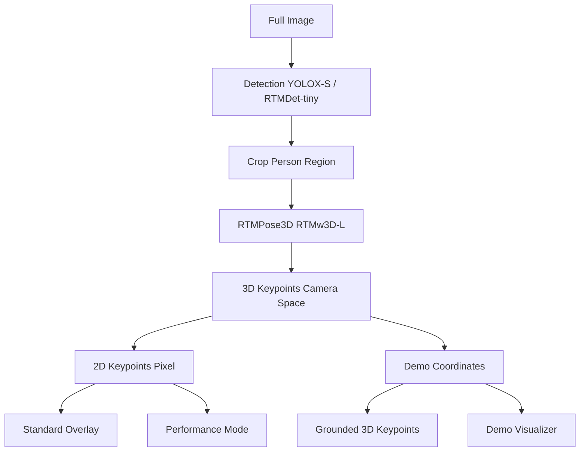

YouTube for camera extrinsic and intrinsic!
[Computer Vision: The Camera Matrix](https://www.youtube.com/watch?v=Hz8kz5aeQ44)


## Introduction

I am into bouldering and would like to do a project using AI for coaching.


## Pre-Stage

### Training Video Collection

**Scape youtube video of bouldering**
Search by names:
Janja, Ai Mori

**Download youtube video**:  https://www.youtube.com/shorts/m4b0uDBh4nE
use iMyFone TopClipper (no good)


Video Editing to remove head and tail.
CapCut or Microsoft Clipchamp -> 用 claude code 改寫一個簡單的 code to trim the video.


## AI Coach 1 (Failed)
先做 3D pose detection (利用 mmpose) 先是整張 image, 後來是先 people detection (mmdetect) 再 pose detection.
=> 再把 background 分離和補全 (利用 temporal homography + medium filtering)
=> background 再用 vggt 轉成 3D point cloud.

## 問題
1.  把 people 和 background 分離，分別做 3D。面臨最後整合在同一個座標系的問題。
2. 另外更嚴重的問題是 loss information cue.  因為人在空間中移動，其實提供 3D background cue.  如果分開重建，反而損失空間 information.

## AI Coach 2 (Monst3r)

此處我們先利用 Monst3r 做 3D point cloud (or depth maps) with moving objects.

基本思路和 AI Coach 1 類似
1. 先用 segmentation  (SAM2) 分開  moving objects,  用 mask 取代 moving objects.   剩下的 background 利用 Dust3r 做 pairwise frames 的 feature extraction and matching and depth estimation (feedforward) 再加上 camera pose estimation (BA).  記住 DUST3r 只有 feedforward (快) 準確度有限，所以還是要有 BA 提高準確度和估計 camera pose.  這點和 VGGT 不同。  Question: 可以用 SAM2 + VGGT? 
	1. 假設 moving objects 沒有佔很大的區域。 SAM2 + Dust3r 是 OK.
2. 下一個問題是如何把 moving object 融合回去？ Monst3r 的做法


## AI Coach 3: 直接 feedforward + moving objects (VGGT+)


> why use sam2 and optical flow? 

⏺ Great question! Let me explain why MonST3R uses SAM2 and optical flow:

  SAM2 (Segment Anything Model 2)

  Purpose: Dynamic/static scene segmentation

  Why needed:
  - MonST3R assumes the scene is mostly static for global optimization
  - Dynamic objects (people running, cars moving, etc.) violate the static scene assumption
  - Without masking, moving objects create inconsistent geometry and trajectory errors

  How it helps:
  - SAM2 identifies dynamic foreground objects across frames
  - Creates dynamic_masks/ that mark moving regions
  - These regions are excluded from optimization (or weighted differently)
  - Result: Cleaner background reconstruction, better camera poses

  Example: In lady-running, the running person is dynamic while the background is static. SAM2 masks the person so
  optimization focuses on the static background.

  Optical Flow (RAFT)

  Purpose: Dense pixel correspondence between consecutive frames

  Why needed:
  - MonST3R's initial depth predictions may have temporal inconsistencies
  - Consecutive frames should have smooth, consistent motion
  - Need additional constraints beyond just geometric reconstruction

  How it helps:
  - RAFT computes pixel motion between frames (2D flow vectors)
  - Flow loss (flow_loss_weight=0.01) enforces that:
    - 3D points should project consistently across frames when accounting for camera motion
    - Temporal smoothness in depth and camera trajectory
  - Acts as a regularization during optimization iterations

  The Pipeline:
  Frame 1, Frame 2 → RAFT → Flow vectors
                       ↓
  Frame 1, Frame 2 → MonST3R → Initial 3D points + poses
                       ↓
           Optimization with flow loss
                       ↓
           Refined 3D points + smooth poses

  Why Real-time Mode (--real_time) is Faster

  Skips both:
  - No SAM2 segmentation
  - No optical flow computation
  - No iterative optimization with flow loss
  - Just feed-forward depth prediction

  That's why it's ~10x faster but lower quality - no temporal consistency enforcement or dynamic object handling.

  Trade-offs

  - With SAM2 + Flow (Options A, B, C): Better quality, slower, handles dynamic scenes
  - Without (Option D): Faster, but temporal inconsistencies and dynamic object artifacts

  For your climbing video (janja1_10fps.mp4), SAM2 would mask the climber, and optical flow would ensure smooth camera motion
   estimation.


## AI Coach 4 (SAM2 + COLMAP + 2D Pose lift to 3D)


  Project Purpose

  This is a 3D pose estimation pipeline for analyzing climbing videos from a handheld/moving camera. It reconstructs
   both the static climbing wall and the dynamic human pose in a unified 3D coordinate system.

  Architecture

  Two-Stage Approach

  Stage 1: Remove climber → reconstruct static background + camera poses (COLMAP)
  Stage 2: Estimate climber's 3D pose → transform to world coordinates

  Why This Design?

  - COLMAP requires a static scene - moving objects break Structure-from-Motion (SfM)
  - SAM 2 provides temporally consistent segmentation masks across video frames
  - Coordinate transformation ensures climber and wall share the same 3D reference frame

  Directory Structure

  bouldering/
  ├── roof_climb.mp4              # Input video (3.4MB)
  ├── frames/                     # Extracted frames (167 frames)
  ├── masks_sam2/                 # Person segmentation masks
  ├── frames_masked/              # Masked frames for COLMAP
  ├── colmap_workspace/           # COLMAP reconstruction outputs
  │   └── sparse/0/
  │       ├── cameras.txt         # Camera intrinsics
  │       ├── images.txt          # Camera extrinsics per frame
  │       └── points3D.txt        # 3D background point cloud
  ├── poses_output/               # Pose estimation results
  │   ├── poses_results.pkl       # 2D poses from MediaPipe
  │   └── poses_3d.pkl           # 3D poses in world coordinates
  ├── poses_visualized/           # 2D pose visualizations
  ├── github/sam2/               # SAM 2 submodule
  └── VIBE/                      # VIBE submodule (optional)

  Key Scripts

  1. Frame Extraction

  - extract_frames.sh: FFmpeg wrapper to extract frames from video
  - Usage: bash extract_frames.sh roof_climb.mp4 frames/

  2. Person Segmentation (Stage 1a)

  - mask_generation_sam2.py: SAM 2 video segmentation
    - Uses facebook/sam2.1-hiera-tiny (or larger models)
    - Auto-detects person with YOLOv8 or uses centered box prompt
    - Generates temporally consistent masks across video frames
    - Output: One binary mask per frame in masks_sam2/

  3. COLMAP Pipeline (Stage 1b)

  - run_colmap.sh / run_colmap_original.sh: COLMAP execution wrappers
  - filter_keypoints_for_colmap.py: Removes features inside person masks
  - colmap_instructions.txt: Detailed COLMAP workflow
  - Output: Camera poses (R, t) and background 3D points

  4. Pose Detection (Stage 2a)

  - run_pose_detection.py: 2D pose detection
    - Uses MediaPipe Pose (fallback) or MMPose (if available)
    - Detects 33 keypoints per frame (MediaPipe format)
    - Output: poses_output/poses_results.pkl

  5. 3D Lifting (Stage 2b)

  - lift_poses_to_3d.py: Lifts 2D poses to 3D using COLMAP camera parameters
    - Single-view depth estimation (assumes person ~5m from camera)
    - Uses camera intrinsics (K) and extrinsics (R, t) from COLMAP
    - Transforms from camera coordinates to world coordinates
    - Output: poses_output/poses_3d.pkl

  6. Visualization

  - visualize_poses.py: Visualizes 2D poses overlaid on frames
  - visualize_3d_scene.py: Combines wall point cloud + 3D poses
    - Creates two views: multiple poses and single pose detail
    - Exports: 3d_scene_combined.png, 3d_scene_single_pose.png, 3d_scene_data.npz

  7. Transform & Scale (To Be Used)

  - transform_and_scale.py: Coordinate transformation with scale alignment
    - Not currently in use (lift_poses_to_3d.py does similar work)
    - Includes anatomical height heuristic for scale (~1.7m person)

  8. Utilities

  - test_sam2_output.py: Verify SAM 2 mask quality
  - run_sam2_batched.py: Batch processing for SAM 2
  - view_npz.py: Inspect NPZ data files

  Data Flow

  roof_climb.mp4
      ↓ [extract_frames.sh]
  frames/*.jpg
      ↓ [mask_generation_sam2.py]
  masks_sam2/*_mask.png
      ↓ [apply masks to frames]
  frames_masked/*.jpg
      ↓ [COLMAP pipeline]
  colmap_workspace/sparse/0/{cameras,images,points3D}.txt
      │
      └─────────────────────┐
                            ↓
  frames/*.jpg ──→ [run_pose_detection.py] ──→ poses_results.pkl
                            ↓
                [lift_poses_to_3d.py + COLMAP params]
                            ↓
                    poses_3d.pkl
                            ↓
                [visualize_3d_scene.py]
                            ↓
            3d_scene_combined.png + 3d_scene_data.npz

  Technology Stack

  Dependencies

  - Python 3.10 (conda environment: openmmlab)
  - SAM 2.1: Video segmentation (facebook/sam2)
  - COLMAP: Structure-from-Motion for static scene reconstruction
  - MediaPipe: 2D/3D pose detection (33 keypoints)
  - MMPose (optional): More accurate 2D pose detection
  - VIBE (optional): SMPL-based 3D pose estimation
  - OpenCV: Image processing
  - NumPy/Matplotlib: Data processing and visualization

  Hardware Requirements

  - GPU: CUDA-enabled (RTX 3090 or similar)
  - VRAM: 6GB+ (hiera_t), 18GB+ (hiera_l)

  Current Status

  Based on the outputs in the directory:

  Completed:
  - ✅ Frame extraction (167 frames)
  - ✅ SAM 2 mask generation
  - ✅ COLMAP reconstruction (38MB database, sparse reconstruction)
  - ✅ 2D pose detection (MediaPipe)
  - ✅ 3D pose lifting with COLMAP parameters
  - ✅ 3D scene visualization (wall + poses)

  Generated Outputs:
  - colmap_3d_points.png / colmap_3d_points_masked.png
  - pose_summary.jpg
  - 3d_scene_combined.png / 3d_scene_single_pose.png
  - 3d_scene_data.npz (777KB)

  Key Coordinate Systems

  Camera Coords (MediaPipe/VIBE) → World Coords (COLMAP)
  Transformation: X_world = R @ X_cam + t
  where R, t come from colmap_workspace/sparse/0/images.txt

  Documentation Files

  - CLAUDE.md: This file - project instructions for Claude Code
  - README.md: Detailed pipeline explanation and usage guide
  - INITIAL.md: Initial project setup notes
  - requirements.md: Dependency installation guide
  - colmap_instructions.txt: COLMAP workflow steps

  Model Options

  SAM 2 Models

  - hiera_t (tiny): Fast, 6GB VRAM, medium quality
  - hiera_s (small): Balanced
  - hiera_b (base): Better edges, 10GB VRAM
  - hiera_l (large): Best quality, 18GB VRAM

  Pose Models

  - MediaPipe Pose: Fast, 33 keypoints, good for single person
  - MMPose RTMPose: More accurate, COCO format (17 keypoints)
  - VIBE: SMPL mesh output, temporal consistency

  Next Steps / Future Enhancements

  Not currently implemented but documented:
  - SMPL mesh fitting for full body model
  - Neural rendering (NeRF/Gaussian Splatting)
  - Multi-person tracking
  - Real-time inference
  - Dense COLMAP reconstruction

  File Naming Conventions

  - Frames: 00001.jpg, 00002.jpg, ...
  - Masks: 00001_mask.png, 00002_mask.png, ...
  - Outputs: poses_results.pkl, poses_3d.pkl, 3d_scene_data.npz

  ---
  This is a well-structured research pipeline that successfully combines state-of-the-art computer vision techniques
   (SAM 2, COLMAP, MediaPipe) to reconstruct both static environment and dynamic human motion from a single handheld
   camera video.


### Pose Detection

利用 mediapipe 做 pose detection.

轉 3D


### 應用

1. Video segmentation
2. Video pose language: Label flagging, cross-over, rock-over, ...


## Stage 1: MediaPipe - 2D Keypoints


## Stage 2:  MMPose - 2D Keypoints


Stage 4: VGGT - MoVieS

## Stage 3: MMPose - 3D Keypoints


First MMDetection, 首先做 object detection (YOLOX-S).  再直接做 3D keypoints / pose detection (rtmpose model).  從 3D keypoints in **camera space** 再轉成 2D keypoints 也做 2D **pixel coordinate** overlay!




# 🗂️ Model and Coordinate System Summary

## Model and Coordinate System Table

|Model Type|Model Name|Purpose|Input|Output Coordinates|Coordinate Space|Usage|
|---|---|---|---|---|---|---|
|🔍 Detection|YOLOX-S|Person localization|Full image|Bounding boxes [x1, y1, x2, y2]|Pixel coordinates|Crop person regions for pose estimation|
||RTMDet-tiny (fallback)|Person detection|Full image|Bounding boxes [x1, y1, x2, y2]|Pixel coordinates|Fallback person detection|
|🎯 3D Pose|RTMPose3D (RTMw3D-L)|End-to-end 3D pose|Person bbox crop|keypoints_3d [K, 3]|Camera space coordinates|3D analysis, visualization|
|📐 2D Pose|Derived from RTMPose3D|2D projection|Same as 3D|keypoints_2d [K, 2]|Pixel coordinates|2D overlay, visualization|

---

## 🗺️ Coordinate Systems and Transformations

|Coordinate System|Description|Format|Range|Source|Usage|
|---|---|---|---|---|---|
|Pixel Coordinates|Image pixel space|[u, v]|[0, width] × [0, height]|Detection model, 2D projection|2D overlay, bounding boxes|
|Camera Space|3D world coordinates|[X, Y, Z]|Real-world units (mm)|RTMPose3D direct output|3D analysis, depth estimation|
|Demo Transform|3D visualization space|[-X, Z, -Y]|Axis-swapped, rebased|Demo coordinate transform|Side-by-side visualization|

---

## 🔄 Data Flow and Transformations

|Step|Process|Input|Transformation|Output|Code Location|
|---|---|---|---|---|---|
|1|Detection|Full image|YOLOX inference|Person bboxes (pixel)|`rtm_pose_analyzer.py:720`|
|2|3D Pose Estimation|Cropped person|RTMPose3D inference|keypoints_3d (camera space)|`rtm_pose_analyzer.py:768`|
|3|2D Derivation|3D keypoints|Pixel projection|keypoints_2d_overlay (pixel)|`rtm_pose_analyzer.py:864`|
|4|Demo Transform|3D keypoints|`keypoints = -keypoints[..., [0, 2, 1]]`|Demo coordinates|`mmpose_visualizer.py:228`|
|5|Ground Rebasing|Demo coordinates|`keypoints[..., 2] -= min(Z)`|Grounded 3D|`mmpose_visualizer.py:238`|

---

## 📊 Camera Parameters

|Parameter|Default Value|Source|Usage|Formula|
|---|---|---|---|---|
|Focal Length|fx = 1145.04, fy = 1143.78|Fixed in model|Camera space conversion|`X_cam = (u - cx) / fx * Z`|
|Principal Point|cx, cy = image_center|Dynamic (image size / 2)|Optical center|`Y_cam = (v - cy) / fy * Z`|
|Camera Params|Can override from dataset|Dataset metadata|Higher accuracy|Replaces defaults when available|

---

## 🎭 Visualization Modes

|Mode|2D Source|3D Source|Coordinate Transform|Purpose|
|---|---|---|---|---|
|Standard Overlay|keypoints_2d_overlay|keypoints_3d|Direct pixel coordinates|Basic 2D pose overlay|
|Demo Visualizer|keypoints_2d_overlay|Demo transformed|Axis swap + rebase|Side-by-side 2D+3D view|
|Performance Mode|Cached analysis|Cached analysis|Frame interpolation|Fast processing|

---

## 🔧 Key Implementation Details

|Aspect|Implementation|Location|Notes|
|---|---|---|---|
|Model Loading|Single RTMPose3D model|`rtm_pose_analyzer.py:172`|End-to-end 3D estimation|
|Detection Fallback|Full-frame if no persons|`rtm_pose_analyzer.py:757`|Graceful degradation|
|Coordinate Storage|Dual format storage|`rtm_pose_analyzer.py:875-876`|Both pixel and camera space|
|Frame Sync|Demo-exact processing|`rtm_pose_analyzer.py:1175-1177`|Eliminates frame interleaving|

---

## 🎯 Summary

This implementation uses a **unified architecture** where:

1. 🔍 **Detection Model**: Localizes persons in pixel space
    
2. 🎯 **Single RTMPose3D Model**: Produces both 2D and 3D coordinates from the same inference
    
3. 📐 **Coordinate Systems**: Multiple representations for different purposes
    
4. 🎭 **Visualization**: Dual-mode support for standard overlay and demo visualizer
    

👉 The key insight is that both **2D and 3D keypoints come from the same RTMPose3D model**, ensuring perfect geometric consistency while supporting multiple coordinate representations for different use cases (overlay, analysis, visualization).


## Why Detection

Multiple people 可以分別做 pose detection.  

Detection Model Used:
  - Primary: YOLOX-S (yolox_s_8x8_300e_coco)
  - Fallback 1: YOLOX-S from model registry
  - Fallback 2: RTMDet-tiny (rtmdet_tiny_8x32_300e_coco)

  **Purpose of Detection Model:**

  1. Person Localization:
  def _detect_persons(self, frame):
      """Detect person bounding boxes for pose estimation input"""
      det_result = inference_detector(self.detector, frame)
      # Filter person class (class_id = 0) with confidence > 0.3

  2. Improved Pose Accuracy:
  - Crop-based processing: Focus RTMPose3D on detected person regions
  - Bbox-relative coordinates: Better accuracy within person bounds
  - Multi-person handling: Separate each detected person for individual pose estimation

  3. Processing Pipeline:
  if self.detector is not None and self.enable_detection:
      bboxes = self._detect_persons(frame)  # Get person bounding boxes
      pose_results = inference_topdown(self.pose3d_model, frame, bboxes)  # Pose estimation within boxes
  else:
      # Fallback: full-frame analysis
      bboxes = np.array([[0, 0, width, height]], dtype=np.float32)

  4. Benefits:
  - Higher precision: RTMPose3D works better on cropped person regions
  - Better multi-person support: Individual detection → individual pose estimation
  - Computational efficiency: Process only relevant image regions
  - Robust handling: Graceful fallback to full-frame if detection fails

  🔧 Summary

  1. Camera projection: Standard pinhole camera model with focal length and principal point
  2. 2D stability: Direct pixel coordinates, minimal transformation
  3. 3D flicker: Multiple coordinate transformations amplify prediction noise
  4. Detection purpose: Person localization for improved pose estimation accuracy and multi-person support


🧠 Key Insights

  Shared Source:
  - Both 2D and 3D keypoints originate from the same RTMPose3D model inference
  - The model is trained end-to-end to predict 3D coordinates directly

  Different Representations:
  - 2D: Image pixel coordinates for overlay visualization
  - 3D: Camera space coordinates with depth information for spatial analysis

  Coordinate Consistency:
  - Since they share the same source, the 2D and 3D keypoints are geometrically consistent
  - The 2D coordinates represent the projection of the 3D points onto the image plane
  - This ensures perfect alignment between 2D overlay and 3D visualization

  💡 Practical Implications

  1. Accuracy: Both coordinate sets have the same detection accuracy since they're from one model
  2. Consistency: No drift between 2D and 3D representations
  3. Efficiency: Single inference produces both coordinate systems
  4. Reliability: Strong geometric relationship between 2D and 3D poses


## Appendix

Perfect 👍 — let’s build a **ready-to-run Python notebook** example for your case:
**MMPose 2D keypoints + bundle adjustment cameras → 3D pose triangulation + visualization**.

This example assumes:

* You already have:

  * 2D pose JSONs from MMPose (`pose2d_results/`)
  * Camera parameters (`cameras.json`)
  * Optional 3D point cloud (`scene.ply`)
* You want a **3D skeleton** in the SfM world coordinate system.

---

## 🧠 Step-by-Step Code (≈100 lines)

```python
# ============================================================
# 🧩 3D Human Pose from MMPose + Bundle Adjustment
# ============================================================

import json
import numpy as np
import open3d as o3d
from mmpose.models.heads.triangulation_head import SimpleTriangulateHead

# ------------------------------------------------------------
# 1. Load bundle-adjusted camera parameters
# ------------------------------------------------------------
with open('cameras.json', 'r') as f:
    cameras = json.load(f)

# Example format per camera in cameras.json:
# {
#   "cam01": {"intrinsic": [[fx,0,cx],[0,fy,cy],[0,0,1]],
#             "extrinsic": [[R11,R12,R13,t1],...],
#             "dist_coeffs": [k1,k2,p1,p2,k3]},
#   "cam02": {...}
# }

# Extract intrinsics/extrinsics into arrays
camera_params = []
for cam_id, cam_data in cameras.items():
    intr = np.array(cam_data["intrinsic"])
    extr = np.array(cam_data["extrinsic"])
    camera_params.append(dict(intrinsic=intr, extrinsic=extr))

# ------------------------------------------------------------
# 2. Load MMPose 2D keypoints from multiple views
# ------------------------------------------------------------
# Each file corresponds to one camera, one frame
import glob

pose2d_files = sorted(glob.glob('pose2d_results/*.json'))

pose2d_list = []
for fpath in pose2d_files:
    with open(fpath, 'r') as f:
        data = json.load(f)
        # Suppose data["keypoints"] = [[x, y, score], ...]
        keypoints = np.array(data["keypoints"])
        pose2d_list.append(keypoints)

pose2d_list = np.stack(pose2d_list, axis=0)  # shape: [num_cams, num_joints, 3]

# ------------------------------------------------------------
# 3. Triangulate to 3D using MMPose's triangulation head
# ------------------------------------------------------------
triangulator = SimpleTriangulateHead()
pose3d = triangulator.forward(pose2d_list, camera_params).detach().cpu().numpy()
# pose3d: [num_joints, 3]

print("Triangulated joints:", pose3d.shape)

# ------------------------------------------------------------
# 4. Visualize with Open3D
# ------------------------------------------------------------
geoms = []

# Load point cloud (optional)
try:
    pcd = o3d.io.read_point_cloud('scene.ply')
    geoms.append(pcd)
except:
    print("No scene.ply found, skipping background cloud.")

# Joints as red points
joint_pcd = o3d.geometry.PointCloud()
joint_pcd.points = o3d.utility.Vector3dVector(pose3d)
joint_pcd.paint_uniform_color([1, 0, 0])
geoms.append(joint_pcd)

# Skeleton lines (connectivity for COCO format)
coco_pairs = [
    (0,1),(1,2),(2,3),(3,4),(1,5),(5,6),(6,7),
    (1,8),(8,9),(9,10),(8,12),(12,13),(13,14),
    (0,15),(0,16)
]

lines = o3d.geometry.LineSet()
lines.points = o3d.utility.Vector3dVector(pose3d)
lines.lines = o3d.utility.Vector2iVector(coco_pairs)
lines.colors = o3d.utility.Vector3dVector([[0, 0, 1] for _ in coco_pairs])
geoms.append(lines)

o3d.visualization.draw_geometries(geoms)

# ------------------------------------------------------------
# 5. Save results
# ------------------------------------------------------------
np.savetxt("pose3d_frame001.txt", pose3d, fmt="%.4f")
print("3D pose saved to pose3d_frame001.txt")
```

---

## 📁 Folder Structure Example

```
project_root/
├── cameras.json
├── scene.ply                # optional
├── pose2d_results/
│   ├── cam01_frame001.json
│   ├── cam02_frame001.json
│   └── cam03_frame001.json
└── triangulate_pose3d.py    # (script above)
```

---

## 🧩 cameras.json Format Example

```json
{
  "cam01": {
    "intrinsic": [[1400.2, 0.0, 960.0],
                  [0.0, 1400.2, 540.0],
                  [0.0, 0.0, 1.0]],
    "extrinsic": [[0.99, 0.01, 0.04, 0.2],
                  [-0.01, 1.00, 0.01, -0.1],
                  [-0.04, -0.01, 0.99, 1.5]]
  },
  "cam02": { ... }
}
```

---

## 🧠 Optional Extensions

* Add **temporal smoothing** with a Kalman filter or Gaussian filter on `pose3d` sequences.
* Integrate with **SMPLify-X** to fit full 3D body meshes.
* For multiple people, repeat the pipeline per person (MMPose detects multiple instances).

---

Would you like me to extend this into a **multi-frame version** (loop over video frames, smooth temporally, and export `.ply` animation)?
That’s often the next step once single-frame triangulation works.


## Reference

- Magnus youtube example
- 